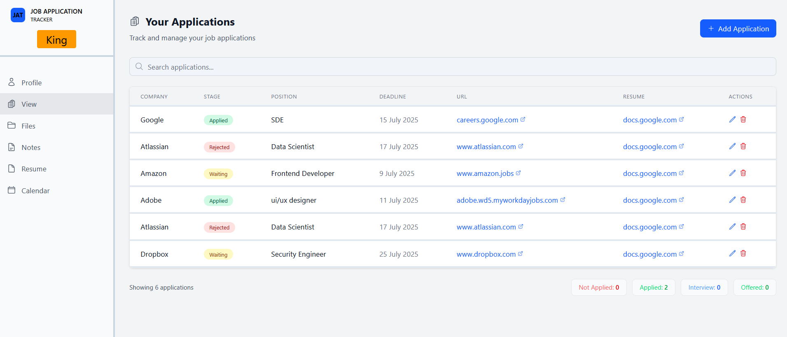
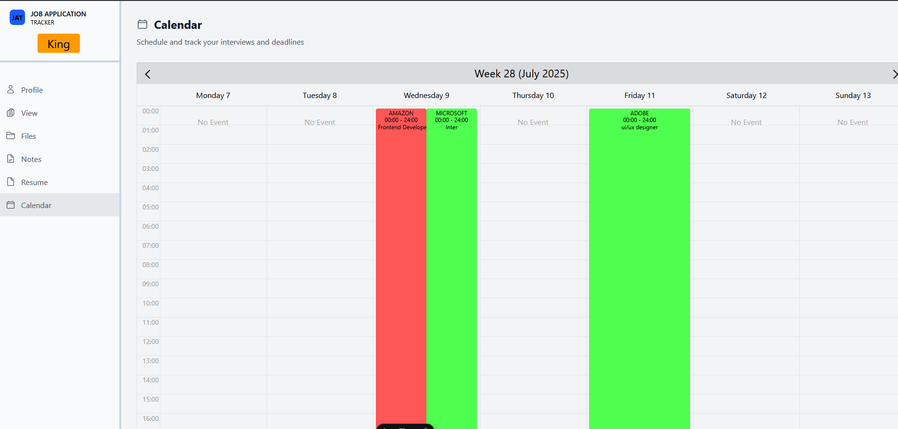
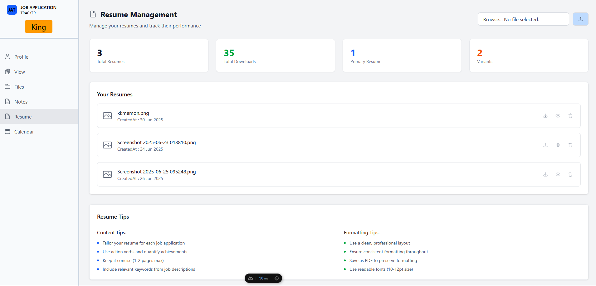

# Job Application Tracker SaaS

A modern SaaS platform to help users manage and track their job applications. Built with **Nuxt 3**, **Supabase**, and **Stripe**, this project integrates user authentication, subscription payments, and dynamic dashboards.

---

## ✨ Features

- 🔐 Authentication via Supabase (email/password, with OAuth support)
- 📋 CRUD operations for job applications
- 📎 Upload and preview resumes (with download option)
- 📅 Integrated calendar to manage application dates & interviews
- 🧲 Drag-and-drop application prioritization based on job position
- 💳 Subscription plans integrated with Stripe Checkout
- 🔁 Stripe Webhook to update user plan/role post-payment
- 📊 Responsive dashboard UI
- ⚙️ Built with Nuxt 3 and H3 API routes

---
## 📸 Featured Screenshots

### 🧲 Drag-and-Drop Application Management

Reorder your job applications by simply dragging and dropping them based on priority, stage, or importance.



---

### 📅 Integrated Calendar View

Stay on top of application deadlines, follow-ups, and interview schedules with a built-in calendar.



---

### 📎 Resume Upload & Management

Upload resumes, view them instantly with live previews, and download them anytime.



---

### 💳 Stripe Checkout Integration

Secure and seamless payment integration with Stripe. Users can upgrade plans via a professional checkout flow.


## 🧩 Tech Stack

- **Nuxt 3** — Frontend and backend (API routes)
- **Supabase** — Database + Auth + Admin operations
- **Stripe** — Payment and webhook management
- **TypeScript** — Full type safety

---

## 🚀 Getting Started

### 1. Clone the repository

```bash
git clone https://github.com/Bully26/JobApplicationTracker_Saas.git
cd JobApplicationTracker_Saas
